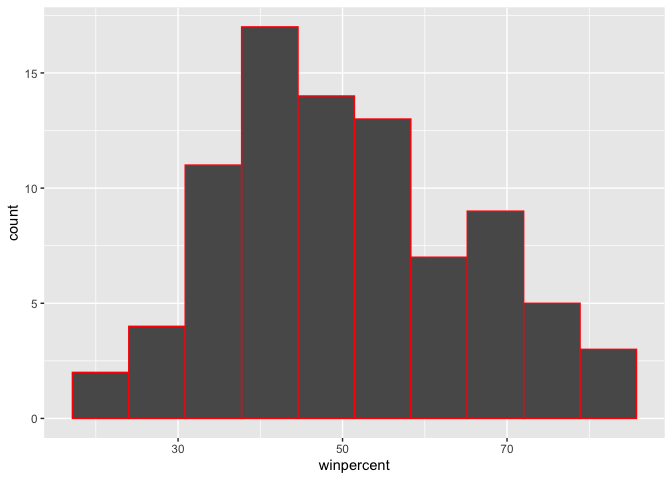
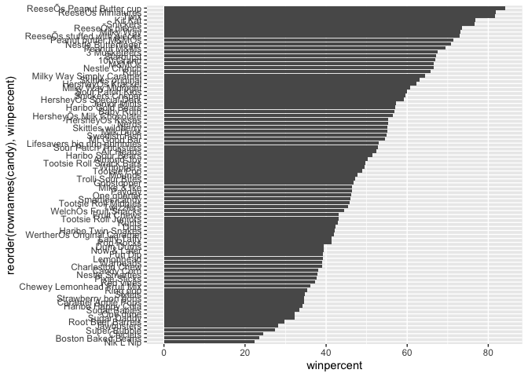
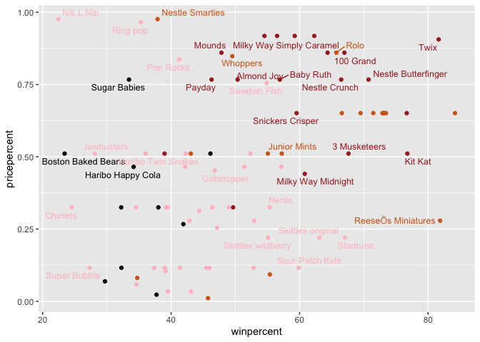
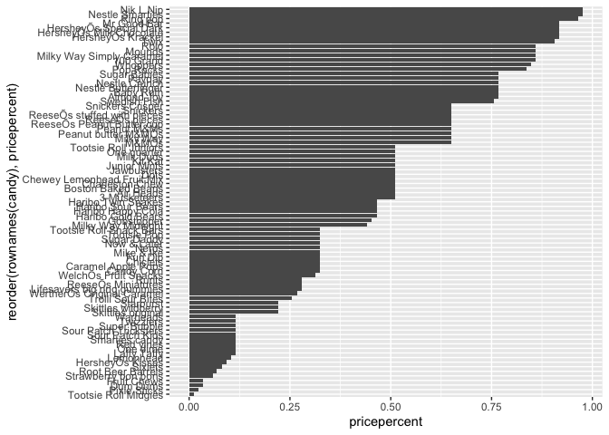
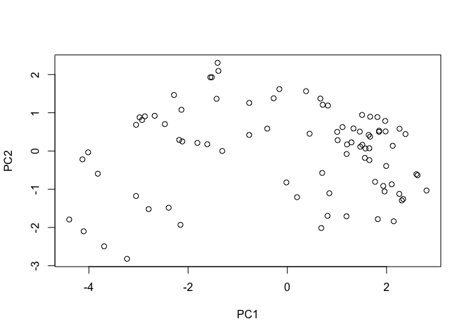
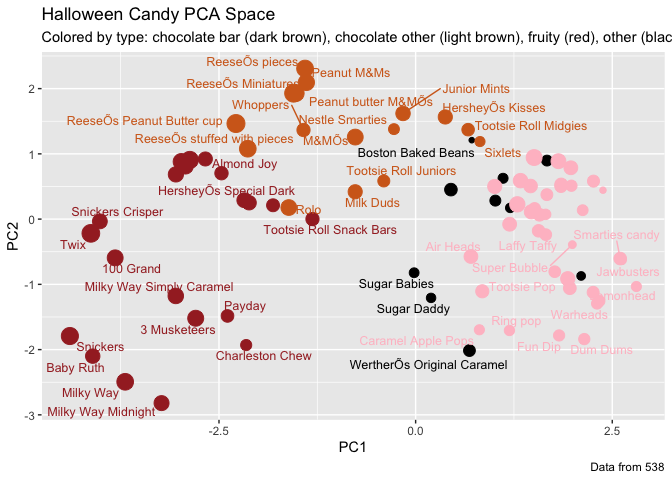
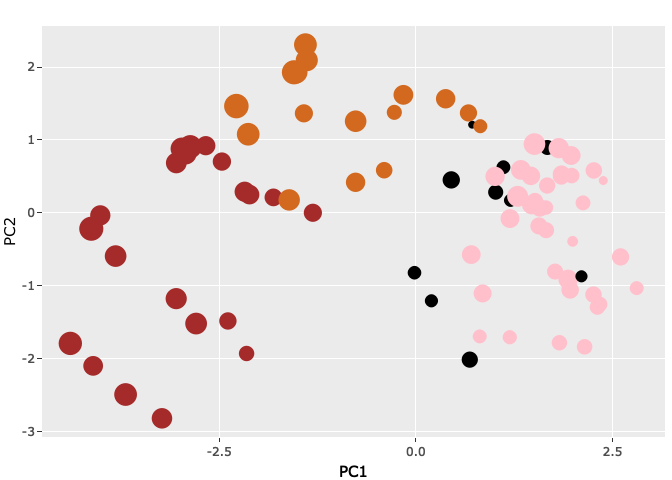

Class 10: Halloween Mini-Project
================
Aishwarya Ramesh

``` r
# webshot::install_phantomjs()
```

## 1. Importing candy data

``` r
candy_file <- 'candy_data.csv'
candy <- read.csv('https://raw.githubusercontent.com/fivethirtyeight/data/master/candy-power-ranking/candy-data.csv', row.names=1)
head(candy)
```

                 chocolate fruity caramel peanutyalmondy nougat crispedricewafer
    100 Grand            1      0       1              0      0                1
    3 Musketeers         1      0       0              0      1                0
    One dime             0      0       0              0      0                0
    One quarter          0      0       0              0      0                0
    Air Heads            0      1       0              0      0                0
    Almond Joy           1      0       0              1      0                0
                 hard bar pluribus sugarpercent pricepercent winpercent
    100 Grand       0   1        0        0.732        0.860   66.97173
    3 Musketeers    0   1        0        0.604        0.511   67.60294
    One dime        0   0        0        0.011        0.116   32.26109
    One quarter     0   0        0        0.011        0.511   46.11650
    Air Heads       0   0        0        0.906        0.511   52.34146
    Almond Joy      0   1        0        0.465        0.767   50.34755

> Q1: How many different candy types are in this dataset?

``` r
dim(candy)
```

    [1] 85 12

There are 85 different types of candy in this dataset.

> Q2. How many fruity candy types are in the dataset?

``` r
sum(candy$fruity)
```

    [1] 38

There are 38 types of fruity candy.

## 2. What is your favorite candy?

Finding `winpercent` value for Twix.

``` r
candy["Twix", ]$winpercent
```

    [1] 81.64291

> Q3. What is your favorite candy in the dataset and what is it’s
> winpercent value?

My favorite candy is Air Heads.

``` r
candy['Air Heads', ]$winpercent
```

    [1] 52.34146

The winpercent value is 52.34146 percent.

> Q4. What is the winpercent value for “Kit Kat”?

``` r
candy['Kit Kat', ]$winpercent
```

    [1] 76.7686

The winpercent value for Kit Kat is 76.7686 percent.

> Q5. What is the winpercent value for “Tootsie Roll Snack Bars”?

``` r
candy['Tootsie Roll Snack Bars', ]$winpercent
```

    [1] 49.6535

It is 49.6535 percent.

(Installed skimr)

``` r
library("skimr")
skim(candy)
```

|                                                  |       |
|:-------------------------------------------------|:------|
| Name                                             | candy |
| Number of rows                                   | 85    |
| Number of columns                                | 12    |
| \_\_\_\_\_\_\_\_\_\_\_\_\_\_\_\_\_\_\_\_\_\_\_   |       |
| Column type frequency:                           |       |
| numeric                                          | 12    |
| \_\_\_\_\_\_\_\_\_\_\_\_\_\_\_\_\_\_\_\_\_\_\_\_ |       |
| Group variables                                  | None  |

Data summary

**Variable type: numeric**

| skim_variable    | n_missing | complete_rate |  mean |    sd |    p0 |   p25 |   p50 |   p75 |  p100 | hist  |
|:-----------------|----------:|--------------:|------:|------:|------:|------:|------:|------:|------:|:------|
| chocolate        |         0 |             1 |  0.44 |  0.50 |  0.00 |  0.00 |  0.00 |  1.00 |  1.00 | ▇▁▁▁▆ |
| fruity           |         0 |             1 |  0.45 |  0.50 |  0.00 |  0.00 |  0.00 |  1.00 |  1.00 | ▇▁▁▁▆ |
| caramel          |         0 |             1 |  0.16 |  0.37 |  0.00 |  0.00 |  0.00 |  0.00 |  1.00 | ▇▁▁▁▂ |
| peanutyalmondy   |         0 |             1 |  0.16 |  0.37 |  0.00 |  0.00 |  0.00 |  0.00 |  1.00 | ▇▁▁▁▂ |
| nougat           |         0 |             1 |  0.08 |  0.28 |  0.00 |  0.00 |  0.00 |  0.00 |  1.00 | ▇▁▁▁▁ |
| crispedricewafer |         0 |             1 |  0.08 |  0.28 |  0.00 |  0.00 |  0.00 |  0.00 |  1.00 | ▇▁▁▁▁ |
| hard             |         0 |             1 |  0.18 |  0.38 |  0.00 |  0.00 |  0.00 |  0.00 |  1.00 | ▇▁▁▁▂ |
| bar              |         0 |             1 |  0.25 |  0.43 |  0.00 |  0.00 |  0.00 |  0.00 |  1.00 | ▇▁▁▁▂ |
| pluribus         |         0 |             1 |  0.52 |  0.50 |  0.00 |  0.00 |  1.00 |  1.00 |  1.00 | ▇▁▁▁▇ |
| sugarpercent     |         0 |             1 |  0.48 |  0.28 |  0.01 |  0.22 |  0.47 |  0.73 |  0.99 | ▇▇▇▇▆ |
| pricepercent     |         0 |             1 |  0.47 |  0.29 |  0.01 |  0.26 |  0.47 |  0.65 |  0.98 | ▇▇▇▇▆ |
| winpercent       |         0 |             1 | 50.32 | 14.71 | 22.45 | 39.14 | 47.83 | 59.86 | 84.18 | ▃▇▆▅▂ |

> Q6. Is there any variable/column that looks to be on a different scale
> to the majority of the other columns in the dataset?

The `winpercent` variable is on a different scale, since all other
variables measure as a proportion out of 1 or as a binary 0 or 1, while
`winpercent` measures as a percent out of 100.

> Q7. What do you think a zero and one represent for the
> candy\$chocolate column?

A 0 means that particular candy is not chocolate, while a 1 means that
particular candy contains chocolate.

Making histograms

> Q8. Plot a histogram of winpercent values

``` r
library(ggplot2)
ggplot(candy)+
  aes(winpercent)+
  geom_histogram(bins=10, col='red')
```



> Q9. Is the distribution of winpercent values symmetrical?

No, the distribution of winpercent values is not symmetrical. There are
more candies that have lower scores than ones that have higher scores.

> Q10. Is the center of the distribution above or below 50%?

Yes, the center of the distribution is from 35-45%.

> Q11. On average is chocolate candy higher or lower ranked than fruit
> candy?

``` r
choc_mean <- mean(candy$winpercent[as.logical(candy$chocolate)])
fruity_mean <- mean(candy$winpercent[as.logical(candy$fruity)])
choc_mean
```

    [1] 60.92153

``` r
fruity_mean
```

    [1] 44.11974

> Q12. Is this difference statistically significant?

``` r
t.test(candy$winpercent[as.logical(candy$chocolate)], candy$winpercent[as.logical(candy$fruity)])
```


        Welch Two Sample t-test

    data:  candy$winpercent[as.logical(candy$chocolate)] and candy$winpercent[as.logical(candy$fruity)]
    t = 6.2582, df = 68.882, p-value = 2.871e-08
    alternative hypothesis: true difference in means is not equal to 0
    95 percent confidence interval:
     11.44563 22.15795
    sample estimates:
    mean of x mean of y 
     60.92153  44.11974 

The difference in between the winpercents is statistically significant
with p = 2.871e-08 \< 0.

## 3. Overall Candy Rankings

Sorting the whole dataset

> Q13. What are the five least liked candy types in this set?

``` r
library(dplyr)
```


    Attaching package: 'dplyr'

    The following objects are masked from 'package:stats':

        filter, lag

    The following objects are masked from 'package:base':

        intersect, setdiff, setequal, union

``` r
least_liked <- rownames(candy %>% arrange(winpercent) %>% head(5))
least_liked
```

    [1] "Nik L Nip"          "Boston Baked Beans" "Chiclets"          
    [4] "Super Bubble"       "Jawbusters"        

The five least liked candy types are ‘Nik L Nip’, ‘Boston Baked Beans’,
‘Chiclets’, ‘Super Bubble’, ‘Jawbusters’.

> Q14. What are the top 5 all time favorite candy types out of this set?

``` r
most_liked <- rownames(candy %>% arrange(desc(winpercent)) %>% head(5))
most_liked
```

    [1] "ReeseÕs Peanut Butter cup" "ReeseÕs Miniatures"       
    [3] "Twix"                      "Kit Kat"                  
    [5] "Snickers"                 

The top 5 all time favorite candy types are Reese’s Peanut Butter Cups,
Reese’s Miniatures, Twix, Kit Kat and Snickers.

Making plots.

> Q15. Make a first barplot of candy ranking based on winpercent values.

``` r
library(ggplot2)
ggplot(candy) + 
  aes(winpercent, rownames(candy)) +
  geom_col()
```


> Q16. This is quite ugly, use the reorder() function to get the bars
> sorted by winpercent?

``` r
ggplot(candy) + 
  aes(winpercent, reorder(rownames(candy), winpercent)) +
  geom_col()
```



### Time to add a useful color

Making black bars for every candy and overrwriting by type

``` r
my_cols=rep("black", nrow(candy))
my_cols[as.logical(candy$chocolate)] = "chocolate"
my_cols[as.logical(candy$bar)] = "brown"
my_cols[as.logical(candy$fruity)] = "pink"
```

``` r
ggplot(candy) + 
  aes(winpercent, reorder(rownames(candy),winpercent)) +
  geom_col(fill=my_cols) 
```


Filling columns with color

> Q17. What is the worst ranked chocolate candy?

The worst ranked chocolate candy is Sixlets.

> Q18. What is the best ranked fruity candy?

The best ranked fruity candy is Starburst.

## 4. Taking a look at pricepoint

Making a plot of winpercent vs pricepercent

``` r
library(ggrepel)

# How about a plot of price vs win
ggplot(candy) +
  aes(winpercent, pricepercent, label=rownames(candy)) +
  geom_point(col=my_cols) + 
  geom_text_repel(col=my_cols, size=3.3, max.overlaps = 5)
```

    Warning: ggrepel: 50 unlabeled data points (too many overlaps). Consider
    increasing max.overlaps



> Q19. Which candy type is the highest ranked in terms of winpercent for
> the least money - i.e. offers the most bang for your buck?

Reeses Miniatures seems to be the highest ranked in terms of winpercent
for the least money.

> Q20. What are the top 5 most expensive candy types in the dataset and
> of these which is the least popular?

``` r
ord <- order(candy$pricepercent, decreasing = TRUE)
head( candy[ord,c(11,12)], n=5 )
```

                             pricepercent winpercent
    Nik L Nip                       0.976   22.44534
    Nestle Smarties                 0.976   37.88719
    Ring pop                        0.965   35.29076
    HersheyÕs Krackel               0.918   62.28448
    HersheyÕs Milk Chocolate        0.918   56.49050

Nik L Nip is the least popular of the top 5 most expensive candy types.

> Q21. Make a barplot again with geom_col() this time using pricepercent
> and then improve this step by step, first ordering the x-axis by value
> and finally making a so called “dot chat” or “lollipop” chart by
> swapping geom_col() for geom_point() + geom_segment().

``` r
# Making barplot of pricepercent
ggplot(candy) +
  aes(pricepercent, reorder(rownames(candy), pricepercent)) +
  geom_col()
```



``` r
# Make a lollipop chart of pricepercent
ggplot(candy) +
  aes(pricepercent, reorder(rownames(candy), pricepercent)) +
  geom_segment(aes(yend = reorder(rownames(candy), pricepercent), 
                   xend = 0), col="gray40") +
    geom_point()
```


## 5. Exploring correlation structure

``` r
library(corrplot)
```

    corrplot 0.92 loaded

``` r
cij <- cor(candy)
corrplot(cij)
```


> Q22. Examining this plot what two variables are anti-correlated
> (i.e. have minus values)?

`chocolate` and `fruity` are anti-correlated.

> Q23. Similarly, what two variables are most positively correlated?

`chocolate` and `bar` is an example of two variables that are positively
correlated.

## 6. Principal Component Analysis

Doing PCA on candy dataset.

``` r
# if we scale
pca <- prcomp(candy, scale = TRUE)
summary(pca)
```

    Importance of components:
                              PC1    PC2    PC3     PC4    PC5     PC6     PC7
    Standard deviation     2.0788 1.1378 1.1092 1.07533 0.9518 0.81923 0.81530
    Proportion of Variance 0.3601 0.1079 0.1025 0.09636 0.0755 0.05593 0.05539
    Cumulative Proportion  0.3601 0.4680 0.5705 0.66688 0.7424 0.79830 0.85369
                               PC8     PC9    PC10    PC11    PC12
    Standard deviation     0.74530 0.67824 0.62349 0.43974 0.39760
    Proportion of Variance 0.04629 0.03833 0.03239 0.01611 0.01317
    Cumulative Proportion  0.89998 0.93832 0.97071 0.98683 1.00000

Plotting PC1 vs PC2

``` r
plot(pca$x[,1:2])
```



Coloring by whether its chocolate, fruity etc.

``` r
plot(pca$x[,1:2], col=my_cols, pch=16)
```


Trying with ggplot2 by making new data-frame

``` r
# Make a new data-frame with our PCA results and candy data
my_data <- cbind(candy, pca$x[,1:3])
```

Then plotting

``` r
p <- ggplot(my_data) + 
        aes(x=PC1, y=PC2, 
            size=winpercent/100,  
            text=rownames(my_data),
            label=rownames(my_data)) +
        geom_point(col=my_cols)

p
```


Labeling plot with non-overlapping candy names

``` r
library(ggrepel)

p + geom_text_repel(size=3.3, col=my_cols, max.overlaps = 7)  + 
  theme(legend.position = "none") +
  labs(title="Halloween Candy PCA Space",
       subtitle="Colored by type: chocolate bar (dark brown), chocolate other (light brown), fruity (red), other (black)",
       caption="Data from 538")
```

    Warning: ggrepel: 39 unlabeled data points (too many overlaps). Consider
    increasing max.overlaps



Getting plotly

``` r
library(plotly)
```


    Attaching package: 'plotly'

    The following object is masked from 'package:ggplot2':

        last_plot

    The following object is masked from 'package:stats':

        filter

    The following object is masked from 'package:graphics':

        layout

Putting our PCA plot into plotly

``` r
ggplotly(p)
```



Taking a final look at our PCA variables

``` r
par(mar=c(8,4,2,2))
barplot(pca$rotation[,1], las=2, ylab="PC1 Contribution")
```


> Q24. What original variables are picked up strongly by PC1 in the
> positive direction? Do these make sense to you?

The fruity, hard and pluribus variables are picked up strongly by PC1 in
the positive direction. This makes sense because these three variables
tend to be correlated. That is, fruity candies tend to be hard or
plural, as opposed to a bar.
